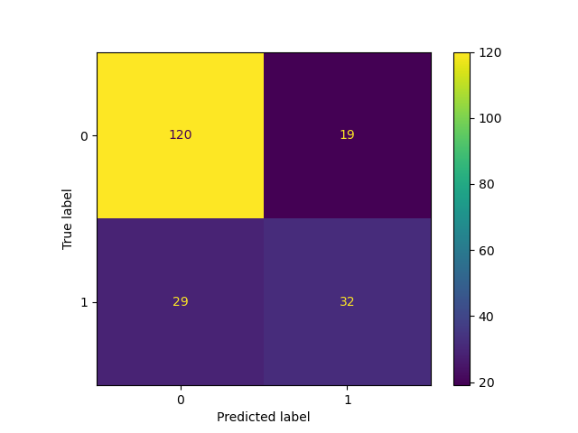

# 💳 CreditWise Loan System

### Intelligent Loan Approval Using Machine Learning

An end-to-end Machine Learning project that automates loan approval decisions using historical financial data.

---

## 🚀 Overview
CreditWise Loan System predicts whether a loan should be **Approved (1)** or **Rejected (0)**, helping banks reduce risk, bias, and processing time.

## 🏦 Business Problem
Manual loan verification is slow, biased, and inconsistent.

## 💡 Solution
A Machine Learning model that evaluates applicant data and predicts loan approval decisions accurately.

## 🧠 ML Pipeline
- Data Cleaning  
- EDA  
- Feature Engineering  
- Model Training  
- Evaluation  

## 🤖 Algorithms
- Logistic Regression  
- KNN   
- Naive Bayes

## 📊 Model Performance

- Logistic Regression Accuracy: 87%
-Naive Bayes Accuracy: 82%

- ## 📈 Confusion Matrix

## 🛠 Tech Stack
Python, Pandas, NumPy, Scikit-learn, Matplotlib, Seaborn 

---

## 🔮 Future Improvements

- Hyperparameter tuning (GridSearchCV)
- ROC Curve visualization
- Model comparison (Random Forest, XGBoost)
- CI/CD integration
- Docker deployment

---

## 👨‍💻 Author

Suresh Jangid  
AI & Data Science Enthusiast
